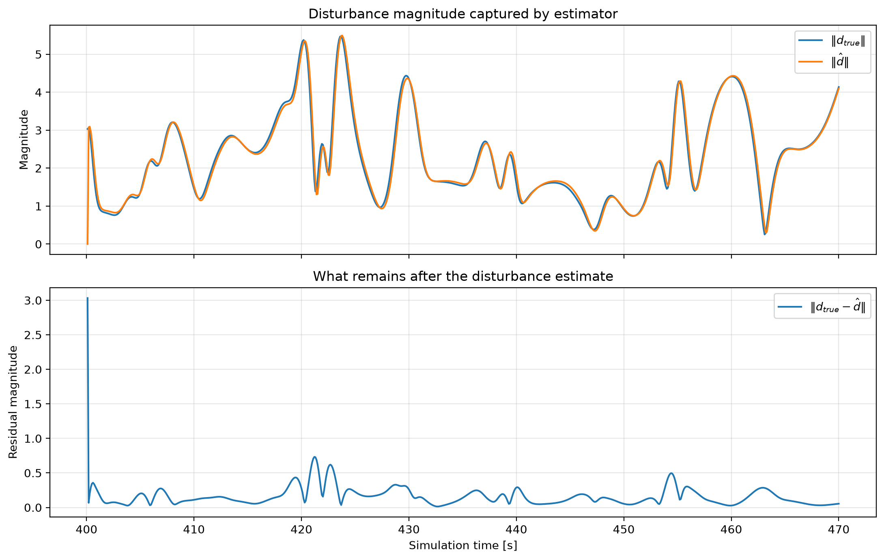
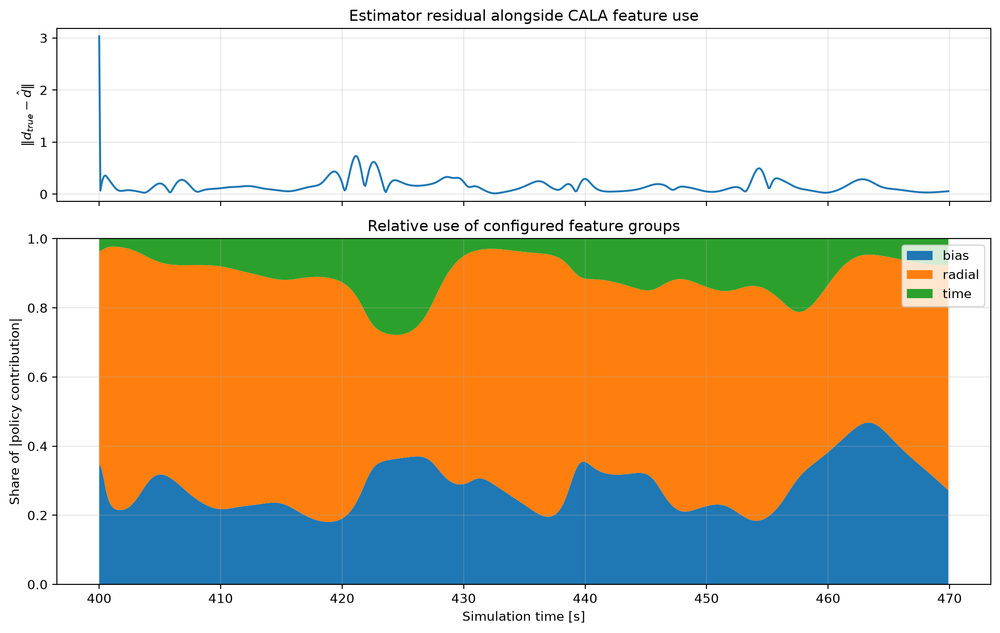
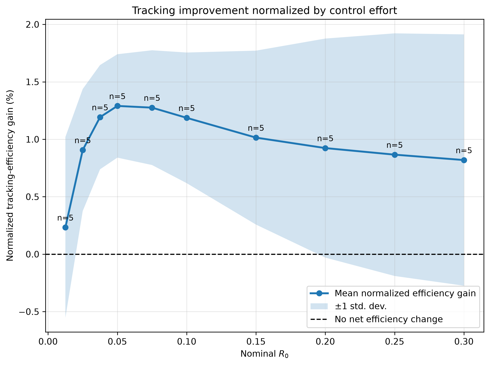
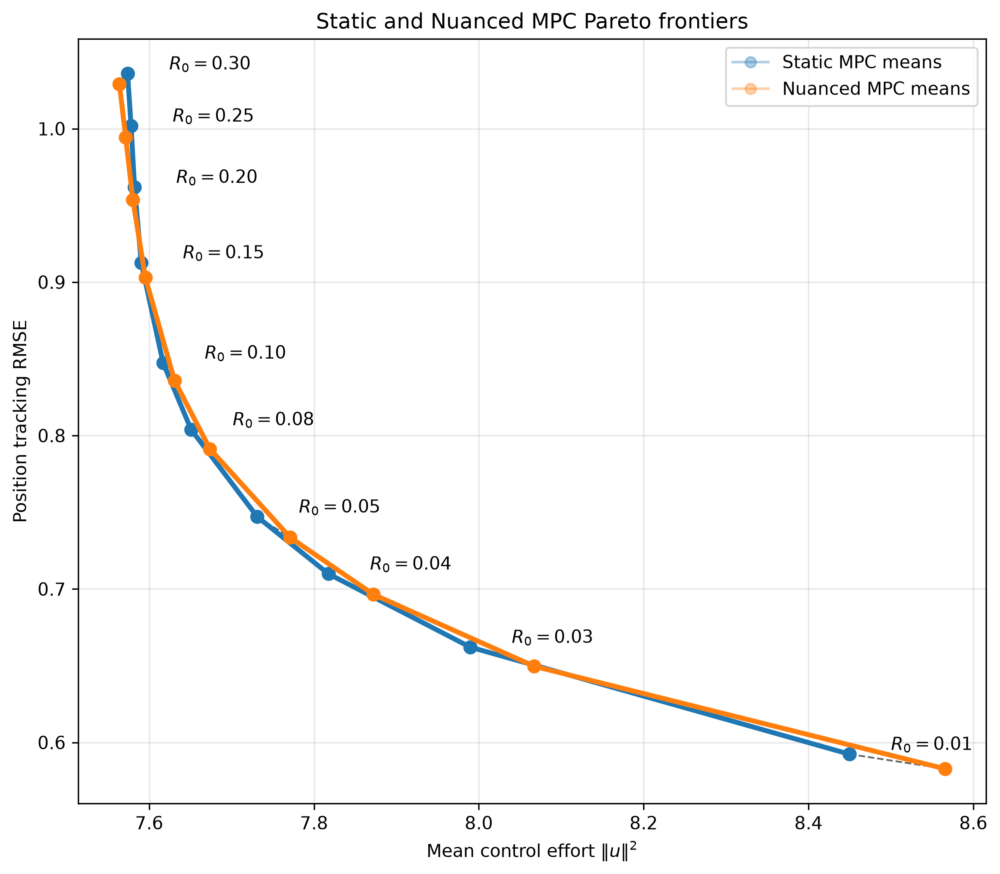
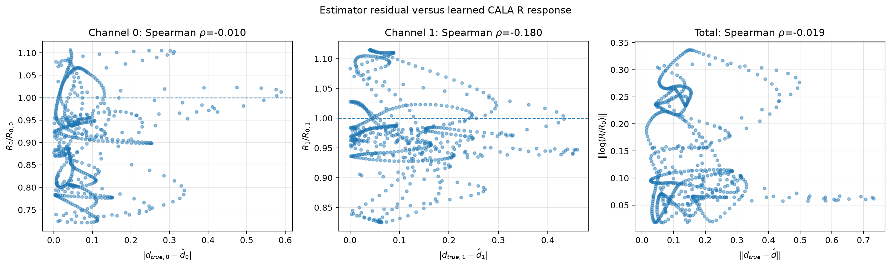
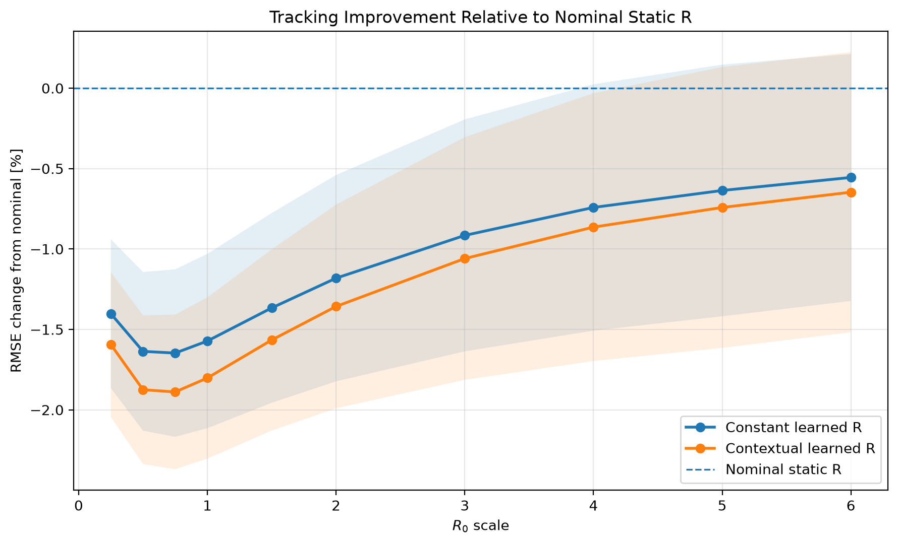
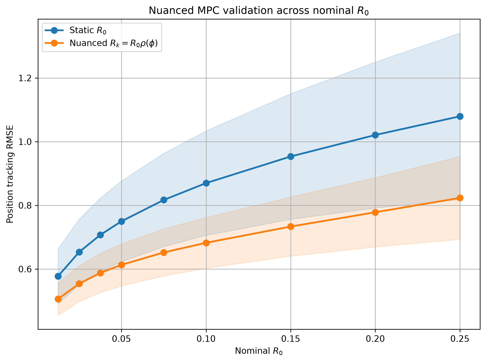
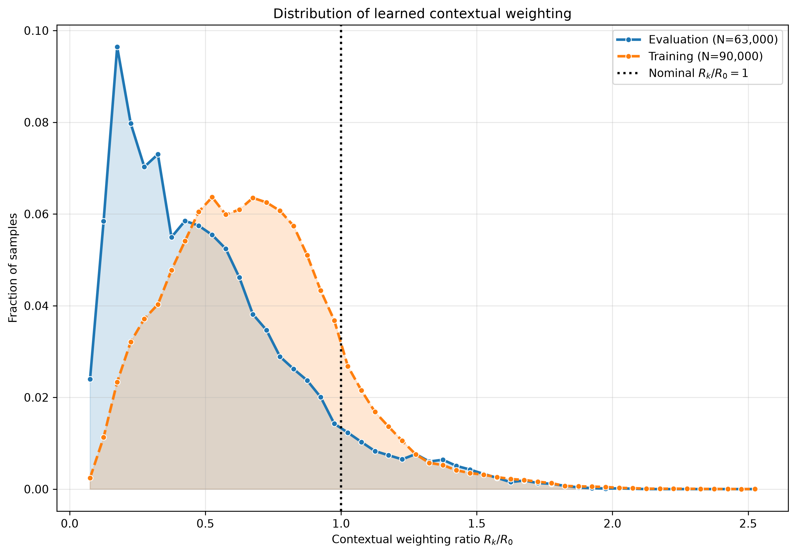
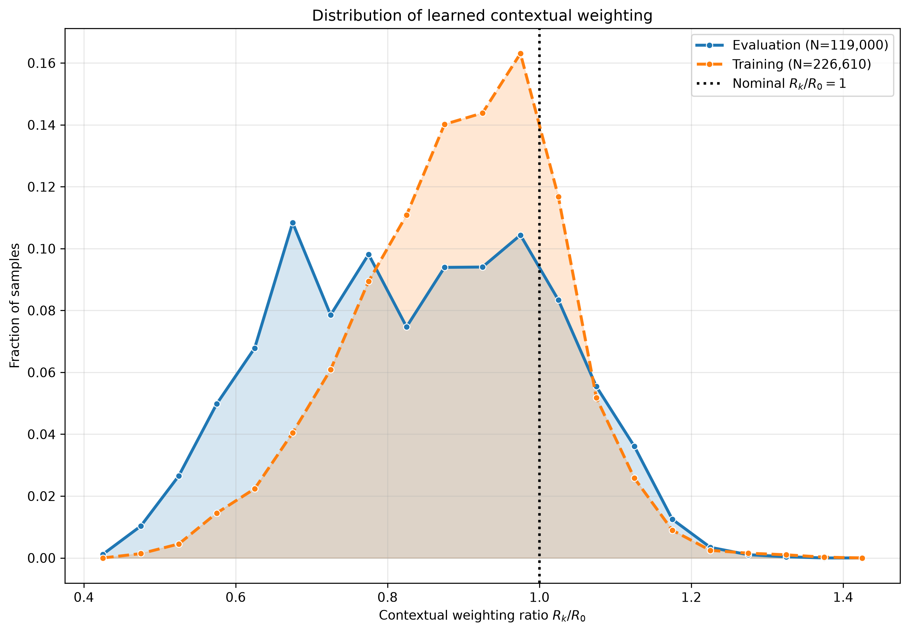
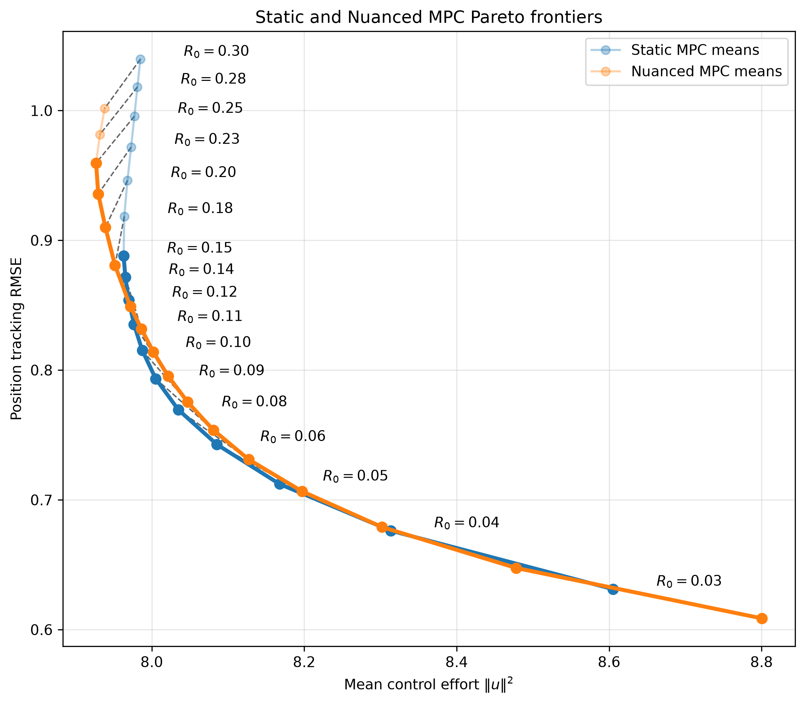

# Nuanced Model Predictive Control via Reinforcement Learning

*This project explores Nuanced Model Predictive Control (nMPC): a lightweight reinforcement-learning layer wrapped around conventional MPC to adapt to changes in the environment. Rather than replacing the controller or choosing actions directly, a Continuous Action Learning Automaton (CALA) adjusts MPC’s nominal control-effort penalty as the operating context changes. Classical disturbance estimation and rejection handle the obvious parts, leaving CALA to focus on modest, interpretable refinements from spatial and temporal features. The result is a controller that keeps the model, constraints, and designer-specified baseline trade-off intact, while adapting that trade-off when conditions call for it. Early experiments are encouraging. Full formulation, analysis, and results to be developed in a forthcoming paper.*

### Motivation

MPC enables the control of dynamical systems by balancing objectives (such as tracking performance), control effort, and constraint satisfaction. Traditionally, it is implemented by repeatedly solving a convex optimization over a finite prediction horizon; this replanning allows the control policy to adapt to changes in the environment. Numerous variations have been developed to guarantee stability and robustness under various conditions. An investigation into some of the these earlier techniques is available [here](docs/README-DISTURBANCE.md). An illustration of Convex MPC being used for target tracking in a time-varying disturbance field is shown below:

<p align="center">
  
</p>

More recent work aims to incorporate learning-based techniques to further improve performance when first-principles analysis is impractical or insufficient. Learning-based MPC approaches typically aims to judiciously leverage data derived from experience while retaining the structural guarantees of traditional MPC. For example, rather then fully replacing a model-based controller, RL can be used to select components of the optimization problem. In our earlier work \[[1](#references)\], we used learning automata to select the relative weights of the objective function itself. This work demonstrated that when properly constrained and situated with an MPC architecture, RL can be used to make better design decisions without compromising hard limitations on stability or constraint satisfaction. A major limitation of this work was that the result of the learning is a single, fixed parameter. For many applications, this is unnecessarily restrictive. Operating conditions can vary substantially over time. For example, a robot may need to act more aggressively in certain regions (to overcome disturbances) or accept some trade-offs in tracking in order to conserve energy elsewhere. Therefore, the challenge is not which parameter to choose, but how much to adjust these parameters over time. 

### Related Work

This work is related to emerging research in *context-aware* MPC, in which external information is used to modify controller parameters. Stefanini *et al.* \[[2](#references)\] developed a context-aware MPC formulation for crowded environments by enriching the optimization problem with observations about human body pose and activity. Fröhlich *et al.* \[[3](#references)\] encoded changes in environmental conditions through coefficients of a learned residual dynamics. Sun *et al.* \[[4](#references)\] proposed a hierarchical framework for traffic control, where deep reinforcement learning modified MPC outputs online. 

This previous work is connected by a common theme touched on by Karpatne *et al.* \[[5](#references)\]: information already available in control theory does not need to be rediscovered through direct observation. Johannink *et al.* \[[6](#references)\] took this idea further, formally describing a decomposition in which conventional control handled one portion of the task, while RL addressed residual components that could not be explicitly modelled. 

## Our Approach

Our work borrows several concepts from the context-aware MPC and MPC–RL approaches described above, while assigning a substantially narrower role to learning. As a clear extension on our previous work \[[1](#references)\], we
employ a lightweight continuous-action learning mechanism to construct an explicit feature map of variations on explicitly-designed MPC parameters. 

Rather than selecting parameters or control actions, we condition the controller to express how it values competing outcomes, which we describe as a *nuance* related to its operating context. In essence, the controller learns, under this operating context, favor a slightly different compromise that initially designed. We do this in a way that remains convex (and therefore tractable in real-time) and respects constraints throughout the learning process. 

Detailed formulations will be described in a forthcoming paper, but we summarize the main parts here:

- **Features**. The operating context ($\Phi$) is represented as a nonlinear feature vector ($\phi_k$), which depends on system state ($x_k$), time ($t_k$), and locally observed disturbances ($\hat d_k$) at sample $k$:

```math
\phi_k=\Phi(x_k,t_k,\hat d_k,\ldots),
```


- **Actions**. Operating context is encoded through feature activations processed by a Continuous Action Learning Automaton (CALA). Learned parameters ($\Theta$) modify the nominal relative weights of the control effort ($R_0$) portion of an MPC optimization through a learned mapping ($\rho$):

```math
R_k = R_0\odot\rho(\phi_k;\Theta)
```

- **Disturbance Residuals**. We preserve a distinct role for conventional adaptation strategies. Specifically, there are well-established techniques for employing local disturbance estimates ($\hat d_k$) inferred from the residuals between measured states and the expected, nominal prediction. Such information need not be re-learned through a separate RL process, so we compute and incorporate this directly into the learning process. Its magnitude and direction help describe the context, allowing CALA to focus on residual nuances.

- **Rewards.** As in the pure MPC optimization, CALA is rewarded for improving tracking performance while minimizing control effort. As described above, ($\hat d_k$) provides useful local context. Therefore, we mediate the cost of control effort relative to this local context. This allows CALA to focus on the nuance of control effort justified by difficult context.

```math
r_k=-\left[\|e_k\|_Q^2+\lambda\frac{\|u_k\|^2}{\epsilon+\|\hat d_k\|^2}\right].
```

Notice the prominent role $R_0$ -- a human-designed parameter -- plays in our approach. The object of CALA is **not** to discover a universal optimal value of $R_k$. A designer may intentionally penalize control effort to encourage energy savings or smoothness, or to minimize stress on components; conversely, they may sacrifice these considerations for tracking performance. $R_0$ represents this intended, nominal compromise. Our learning agent determines when, where, and by how much to depart from this initial design when justified by the current context. 

# Results (Initial)

Below are initial results, which will be presented in greater detail in a future paper.

## Field Generation

In `nonlinear_field.py`, we produce a time-varying disturbance field, as illustrated below:

<p align="center">
  
</p>

## Features 

After building the space and time features described above (19 total in this case), we used [Uniform Manifold Approximation and Projection (UMAP)](https://umap-learn.readthedocs.io/en/latest/) to reduce the dimensionality and visualize the features in terms of direction and magnitude of the disturbances:

| Direction | Magnitude |
|:---:|:---:|
|  |  |

UMAP preserves local neighbourhoods well, and these plots give us useful information about the field dynamics from an RL perspective:

- Nearby feature contexts (not necessarily physically near), have similar disturbance directions and magnitudes. 
- The environment is well-structured and probably exploitable. 
- The problem looks to be locally smooth.
- Learning results should be generalizable across previously unexplored contexts. 
- There are some hard transition regions. 

## Disturbance Rejection

As mentioned above, we leverage well-established techniques for locally-inferred disturbance rejection using model residuals. Below illustrates this works pretty well. In orange, we see MPC struggling to track the target without any disturbance rejection. In blue, we see locally-inferred disturbance rejection works pretty well. A more detailed investigation of this can be found in a supplemental README [here](docs/README-DISTURBANCE.md). 

<p align="center">
  
</p>

Looking closer, when we compare the true disturbances to the estimated, we see there remains residual, uncaptured dynamics. What is useful here is that this classical disturbance rejection already provides a lot of the heavy lifting for us. This leaves room for CALA to focus on the nuances in these residuals. 

<p align="center">
  
</p>


## Learning 

A detailed implementation of our learning process is available in our custom `cala.py` module. As CALA explored the search space, confidence was expressed by a reduction in sigma-variance. Below we seen an example of this variance reducing during a representative trial. 

| Exploration Progress (mean) | Exploration Progress (all features) |
|:---:|:---:|
|  |  |

Note that CALA found itself more confident in some features than others, reflecting its incomplete experience. Below shows the relative contributions of the feature groups (bias, radial, and time) across the residual disturbances described earlier.  


<p align="center">
  
</p>


## Evaluation 

We evaluated the learning performance using a number of benchmarks. 

### It improves performance 

Here we provide a high-level comparison of the learned controller compared to the benchmark $diag(R_o) = [0.05, 0.05]$. CALA able to develop enough understanding of the environment to generalize and make refinements to the controller (i.e., $R_k$ described above) online. Small, local refinements online based on this **nuanced** understanding of the context improved both tracking performance  while also reducing control effort.

<p align="center">
  
</p>

### It doesn't cost more

We repeated this evaluation across a range of $R_0$ diagonal values from $0.01$ to $0.30$. The gains in tracking performance normalized for control effort are provided below. A plot of the combined pareto frontier is also provided, suggesting CALA optimizes along this underlying trade-off between control and performance.

<p align="center">
  
  
</p>

### It is not just another estimator

A useful check is whether CALA has merely learned a direct mapping from estimator error. As shown below, a pointwise comparison of the Spearman correlations are small (between -0.01 and 0.18), suggesting large estimator residuals do not map monotonically to large departures of $R_0$ from nominal.

<p align="center">
  
</p>

This is consistent our desired role of CALA: it is learning a performance-conditioned control policy, not another disturbance estimator.

### It is actually learning context

As the goal is to learn nuanced context, we want to confirm CALA is not simply learning a better fixed value of $R$. To isolate these effects, the contextual controller is compared with:

- Nominal static: the original designer-selected $R_0$
- Constant learned: the mean $\bar{R}_k$ learned by CALA
- Contextual learned: the full $R_k=R_0\rho(\phi_k)$ policy


<p align="center">
  
</p>

The constant learned $\bar{R}_k$ accounts for most of the total tracking improvement. However, the contextual learned $R_k$ remains consistently below. The gap between these two learned curves represents the incremental closed-loop value of context. The effects are small, systematic across the $R_0$ sweep. This demonstrates that the observed benefit is not explained solely by global retuning.


<!--

### Pareto Analysis

We implemented learning across a diverse range of initial conditions and configurations. Performance was evaluated using Root Mean Squared Error (RMSE) across 10 independent $70-s$ trials for each of nine nominal $R_0$ values, comparing nominal MPC (i.e., static parameters) against the learned Nuanced MPC controller. Here we see a clear improvement in RMSE when Nuanced MPC is used in terms of both mean and variance of RMSE. However, this improvement must be considered within the context of the tracking and control-effort trade off. We want our approach to judicially adjust for the local context, not simply find a more aggressive control policy. 

<p align="center">
  
</p>

At left, we see the distribution of the contextual weighting ratio ($R_k/R_0$) for our initial experiment. Notice both the training and evaluation are heavily biased towards more aggressive control effort. This suggests our controller has merely learned that greater control effort (i.e., lower values of $R_k$ relative to $R_0$) reduces RMSE. The evaluation distribution also suggests this aggression overpowers the controller's ability to make nuanced adjustments. Therefore, we reduced the search space to generally lower values of $R_k$ and increased the relative weight of control effort in the reward. At right, we see a more encouraging distribution, where control effort is spread more evenly (presumably, adapting to context in the environment).

<p align="center">
  
  
</p>


We ran the learning for a span of $R_0$ values from $0.03$ to $0.3$ and plotted the RMSE across another 10 independent $70-s$ evaluation trials. The plot below presents the results with respect to the trade-off in position tracking and control effort (i.e., the Pareto frontier). Here we infer a few encouraging things:

1. Nuanced MPC generally improves tracking performance by shifting the controllers toward more aggressive control inputs.

2. This shift occurs roughly along the Static MPC Pareto frontier, indicating that the tracking improvements are obtained through trade-offs similar to those available through conventional fixed MPC tuning. 

3. Unlike Static MPC, Nuanced MPC realizes these operating points dynamically online as context-dependent adjustments.

4. The benefit becomes more apparent at larger values of $R_0$ (i.e., where the designer places greater emphasis on limiting control effort). In this region, Nuanced MPC can recover performance while retaining much of the intended reduction in control effort.

5. At the low-effort end of the trade-off, Nuanced MPC reaches operating points not attained by Static MPC configurations, suggesting that contextual adaptation may extend the empirical Pareto frontier and permit improved tracking–effort trade-offs beyond those achievable through fixed-$R$ tuning.

<p align="center">
  
</p>


## Future work
- Describe the control architecture in greater detail
- Flesh out the mathematical formulations, including feature design and RL process 
- Carry out a formal stability analysis 
- Demonstrate performance across broader range of contexts

-->

## References

If you would like to reference this work, please use this BibLaTex citation: 

```
@online{jardine2026contextmpc,
  author  = {Jardine, P. T.},
  title   = {Nuanced Model Predictive Control (nMPC) Source Code},
  year    = {2026},
  url     = {https://github.com/tjards/nuanced_mpc},
  urldate = {2026-08-26}
}
```

[1] P. T. Jardine, M. Kogan, S. N. Givigi, and S. Yousefi, ["Adaptive predictive control of a differential drive robot tuned with reinforcement learning,"](https://doi.org/10.1002/acs.2882) *International Journal of Adaptive Control and Signal Processing*, vol. 33, no. 2, pp. 410–423, 2019.

[2] E. Stefanini, L. Palmieri, A. Rudenko, T. Hielscher, T. Linder, and L. Pallottino, ["Efficient Context-Aware Model Predictive Control for Human-Aware Navigation,"](https://doi.org/10.1109/LRA.2024.3461552) *IEEE Robotics and Automation Letters*, vol. 9, no. 11, pp. 9494–9501, 2024.

[3] L. P. Fröhlich, C. Küttel, E. Arcari, L. Hewing, M. N. Zeilinger, and A. Carron, ["Contextual Tuning of Model Predictive Control for Autonomous Racing,"](https://arxiv.org/abs/2110.02710) arXiv:2110.02710, 2021.

[4] D. Sun, A. Jamshidnejad, and B. De Schutter, ["A Novel Framework Combining MPC and Deep Reinforcement Learning With Application to Freeway Traffic Control,"](https://doi.org/10.1109/TITS.2023.3342651) *IEEE Transactions on Intelligent Transportation Systems*, vol. 25, no. 7, pp. 6756–6769, 2024.

[5] A. Karpatne, G. Atluri, J. H. Faghmous, M. Steinbach, A. Banerjee, A. Ganguly, S. Shekhar, N. Samatova, and V. Kumar, ["Theory-Guided Data Science: A New Paradigm for Scientific Discovery from Data,"](https://doi.org/10.1109/TKDE.2017.2720168) *IEEE Transactions on Knowledge and Data Engineering*, vol. 29, no. 10, pp. 2318–2331, 2017.

[6] T. Johannink, S. Bahl, A. Nair, J. Luo, A. Kumar, M. Loskyll, J. A. Ojea, E. Solowjow, and S. Levine, ["Residual Reinforcement Learning for Robot Control,"](https://doi.org/10.1109/ICRA.2019.8794127) in *2019 International Conference on Robotics and Automation (ICRA)*, pp. 6023–6029, 2019.