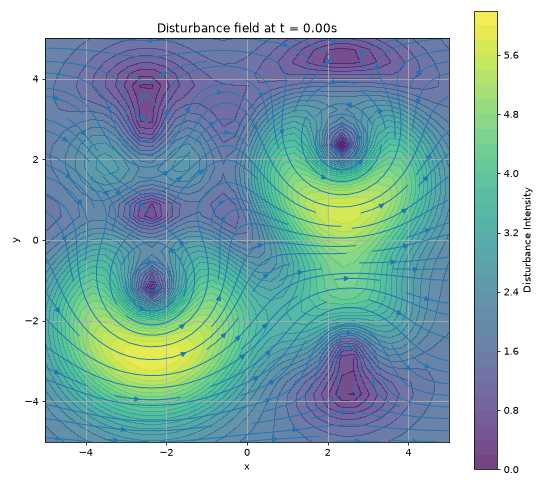
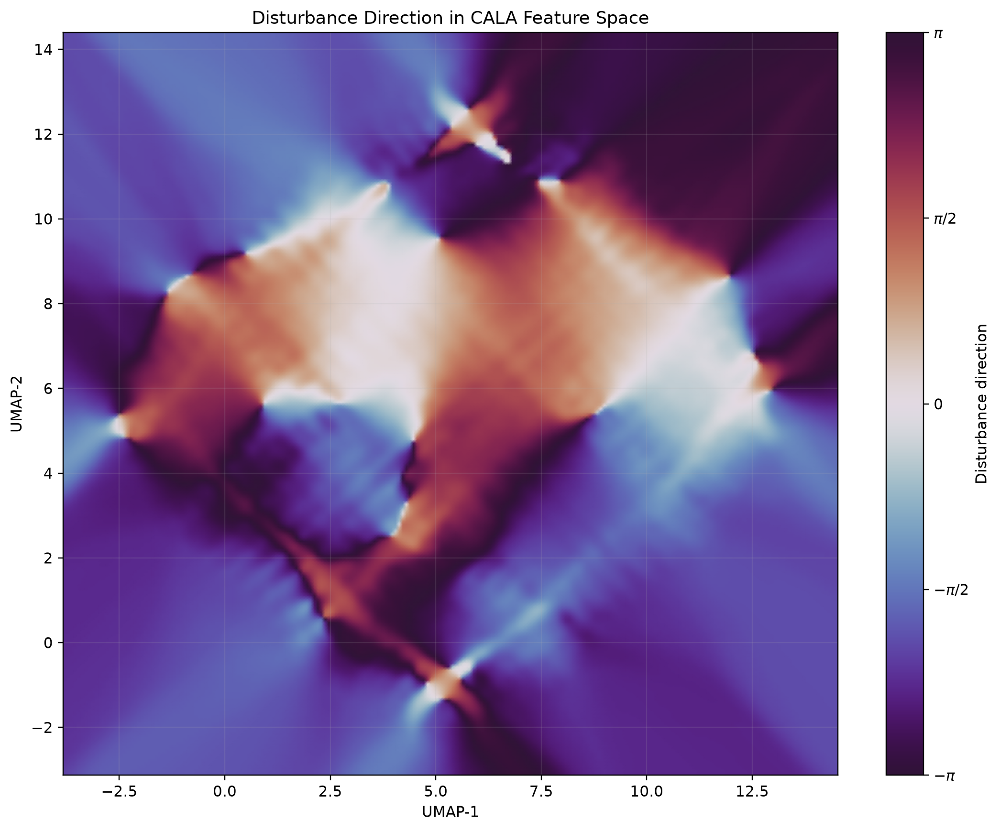
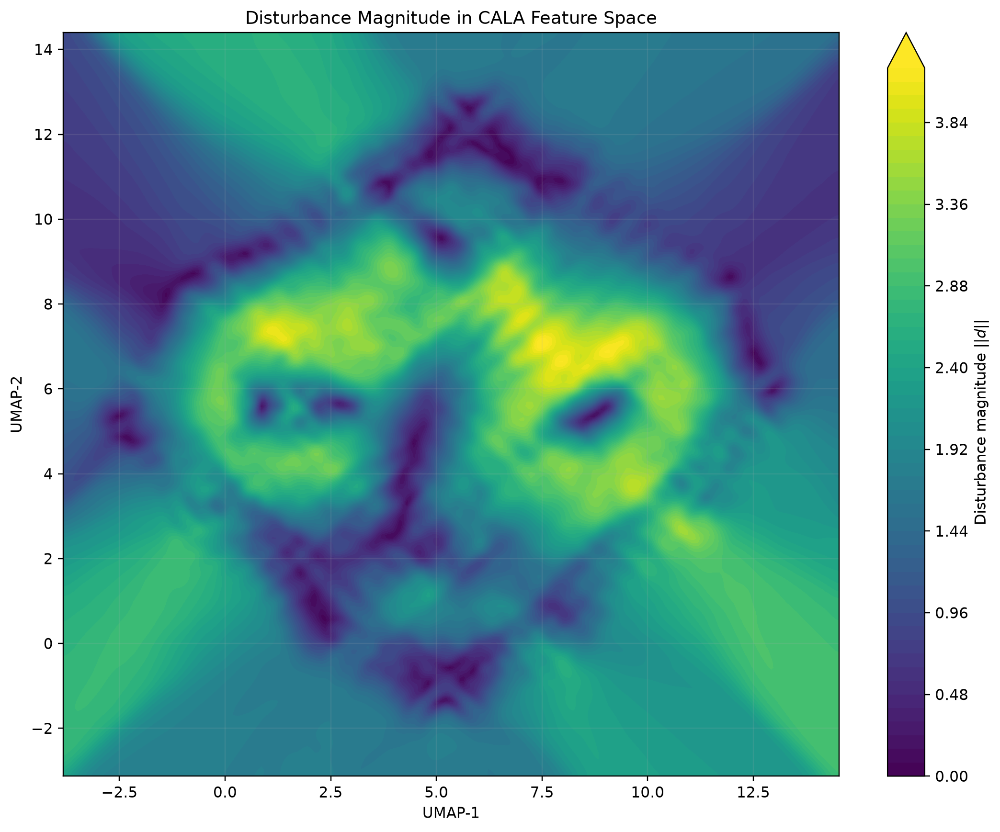
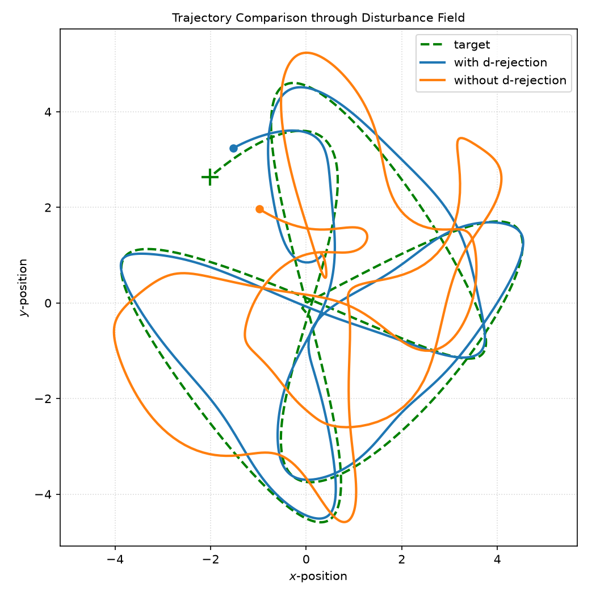
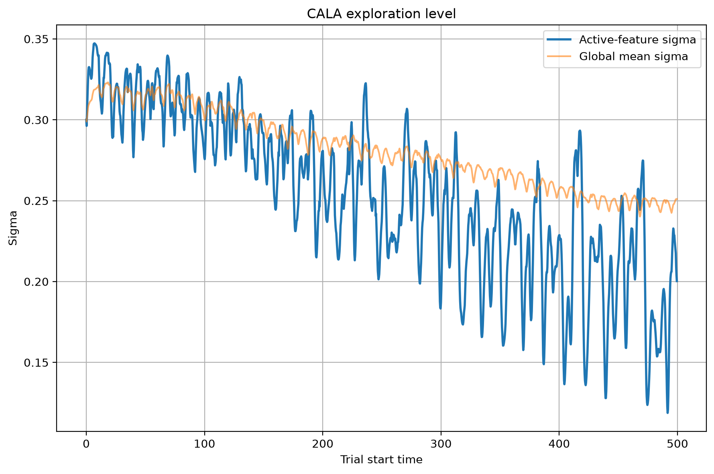
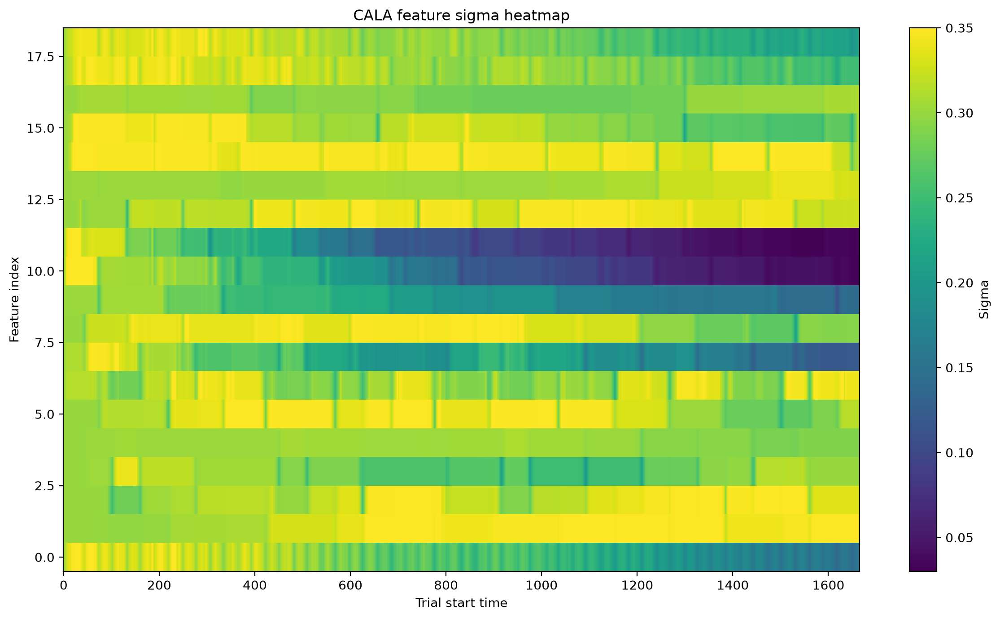
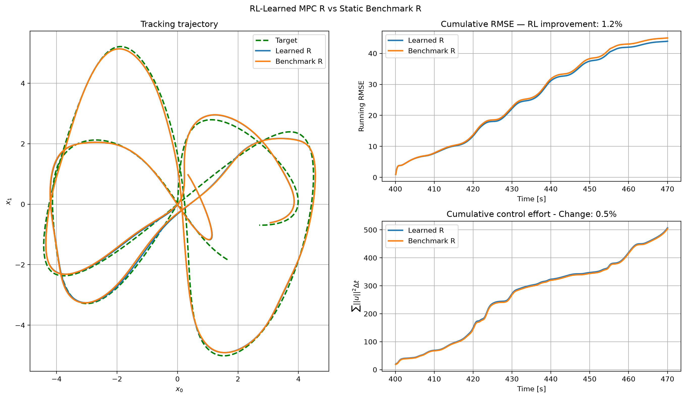

# Nuanced Model Predictive Control via Reinforcement Learning

Summary: *This project implements Nuanced Model Predictive Control (nMPC) for a robot operating within a time-varying, nonlinear disturbance field. Rather than learning specific parameters or control actions directly, the controller makes subtle, context-dependent refinements to how it balances competing objectives. These refinements are based on experience accumulated through Reinforcement Learning (RL) and expressed through variations on relative weights in the objective function. We describe this process as adding nuance to the controller’s nominal tradeoff between tracking performance and control effort. In essence, the controller learns: “under this operating context, favor a slightly different compromise than originally designed.”.*

### Motivation

MPC enables the control of dynamical systems by balancing objectives (such as tracking performance), control effort, and constraint satisfaction. Traditionally, it is implemented by repeatedly solving a convex optimization over a finite prediction horizon; this replanning allows the control policy to adapt to changes in the environment. Numerous variations have been developed to guarantee stability and robustness under various conditions. An investigation into some of the these earlier techniques is available [here](docs/README-DISTURBANCE.md). An illustration of Convex MPC being used for target tracking in a time-varying disturbance field is shown below:

<p align="center">
  
</p>

More recent work aims to incorporate learning-based techniques to further improve performance when first-principles analysis is impractical or insufficient. Learning-based MPC approaches typically aims to judiciously leverage data derived from experience while retaining the structural guarantees of traditional MPC. For example, rather then fully replacing a model-based controller, RL can be used to select components of the optimization problem. In our earlier work \[[1](#references)\], we used learning automata to select the relative weights of the objective function itself. This work demonstrated that when properly constrained and situated with an MPC architecture, RL can be used to make better design decisions without compromising hard limitations on stability or constraint satisfaction. A major limitation of this work was that the result of the learning is a single, fixed parameter. For many applications, this is unnecessarily restrictive. Operating conditions can vary substantially over time. For example, a robot may need to act more aggressively in certain regions (to overcome disturbances) or accept some trade-offs in tracking in order to conserve energy elsewhere. Therefore, the challenge is not which parameter to choose, but how much to adjust these parameters over time. 

### Related Work

This work is related to emerging research in *context-aware* MPC, in which external information is used to modify controller parameters. Stefanini *et al.* \[[2](#references)\] developed a context-aware MPC formulation for crowded environments by enriching the optimization problem with observations about human body pose and activity. Fröhlich *et al.* \[[3](#references)\] encoded changes in environmental conditions through coefficients of a learned residual dynamics. Sun *et al.* \[[4](#references)\] proposed a hierarchical framework for traffic control, where deep reinforcement learning modified MPC outputs online. 

This previous work is connected by a common theme touched on by Karpatne *et al.* \[[5](#references)\]: information already available in control theory does not need to be rediscovered through direct observation. Johannink *et al.* \[[6](#references)\] took this idea further, formally describing a decomposition in which conventional control handled one portion of the task, while RL addressed residual components that could not be explicitly modelled. 

## Our Approach

Our work borrows several concepts from the context-aware MPC and MPC–RL approaches described above, while assigning a substantially narrower role to learning. As a clear extension on our previous work \[[1](#references)\], we
employ a lightweight continuous-action learning mechanism to construct an explicit feature map of variations on explicitly-designed MPC parameters. 

Rather than selecting parameters or control actions, we condition the controller to express how it values competing outcomes, which we describe as a *nuance* related to its operating context. In essence, the controller learns, under this operating context, favor a slightly different compromise that initially designed. We do this in a way that remains convex (and therefore tractable in real-time) and respects constraints throughout the learning process. 

Detailed formulations will be described in a forthcoming paper, but we summarize the main parts here:

- **Features**. The operating context ($\Phi$) is represented as a nonlinear feature vector ($\phi_k$), which depends on system state ($x_k$), time ($t_k$), and locally observed disturbances ($\hat d_k$) at sample $k$:
$$
\phi_k=\Phi(x_k,t_k,\hat d_k,\ldots),
$$


- **Actions**. Operating context is encoded through feature activations processed by a Continuous Action Learning Automaton (CALA). Learned parameters ($\Theta$) modify the nominal relative weights of the control effort ($R_0$) portion of an MPC optimization through a learned mapping ($\rho$):

```math
R_k = R_0\odot\rho(\phi_k;\Theta)
```

- **Disturbance Residuals**. We preserve a distinct role for conventional adaptation strategies. Specifically, there are well-established techniques for employing local disturbance estimates ($\hat d_k$) inferred from the residuals between measured states and the expected, nominal prediction. Such information need not be re-learned through a separate RL process, so we compute and incorporate this directly into the learning process. Its magnitude and direction help describe the context, allowing CALA to focus on residual nuances.

- **Rewards.** As in the pure MPC optimization, CALA is rewarded for improving tracking performance while minimizing control effort. As described above, ($\hat d_k$) provides useful local context. Therefore, we mediate the cost of control effort relative to this local context. This allows CALA to focus on the nuance of control effort justified by difficult context.

```math
r_k=-\left[\|e_k\|_Q^2+\lambda\frac{\|u_k\|^2}{\epsilon+\|\hat d_k\|^2}\right].
```

Notice the prominent role $R_0$ -- a human-designed parameter -- plays in our approach. The object of CALA is **not** to discover a universal optimal value of $R_k$. A designer may intentionally penalize control effort to encourage energy savings or smoothness, or to minimize stress on components; conversely, they may sacrifice these considerations for tracking performance. $R_0$ represents this intended, nominal compromise. Our learning agent determines when, where, and by how much to depart from this initial design when justified by the current context. 

# Results (Initial)

Below are initial results, which will be presented in greater detail in a future paper.

### Field Generation

In `nonlinear_field.py`, we produce a time-varying disturbance field, as illustrated below:

<p align="center">
  
</p>

### Features 

After building the space and time features described above (in this, case 19 total), we used [Uniform Manifold Approximation and Projection (UMAP)](https://umap-learn.readthedocs.io/en/latest/) to reduce the dimensionality and visualize the features in terms of direction and magnitude of the disturbances:

| Direction | Magnitude |
|:---:|:---:|
|  |  |

UMAP preserves local neighbourhoods well, and these plots give us useful information about the field dynamics from an RL perspective:

- Nearby feature contexts (not necessarily physically near), have similar disturbance directions and magnitudes. 
- The environment is well-structured and probably exploitable. 
- The problem looks to be locally smooth.
- Learning results should be generalizable across previously unexplored contexts. 
- There are some hard transition regions. 

### Disturbance Rejection

As mentioned above, we leverage well-established techniques for locally-inferred disturbance rejection using model residuals. Below illustrates this works pretty well. In orange, we see MPC struggling to track the target without any disturbance rejection. In blue, we see locally-inferred disturbance rejection works pretty well. A more detailed investigation of this can be found in a supplemental README [here](docs/README-DISTURBANCE.md). 

<p align="center">
  
</p>

What is useful here is that this classical disturbance rejection already provides a lot of the heavy lifting for us. This leaves room for CALA to focus on nuances not captured by model residuals. 

### Learning Results

A detailed implementation of our learning process is available in our custom `cala.py` module. As CALA explored the search space, confidence was expressed by a reduction in sigma-variance. Below we seen an example of this variance reducing during a representative trial. 

| Exploration Progress (mean) | Exploration Progress (all features) |
|:---:|:---:|
|  |  |

Note that CALA found itself more confident in some features than others, reflecting its incomplete experience. Despite this partial information, it was able to develop enough understanding of the environment to generalize and make refinements to the controller (i.e., $R_k$ described above) online. Below we see that these nuanced refinements improved the tracking performance substantially (nearly 30%) while also reducing control effort (by approximately 1%). 

<p align="center">
  
</p>

Note that these improvements were made by making small, local refinements online based on a **nuanced** understanding of the context derived from past experience.

## Future work

- Describe the control architecture in greater detail
- Flesh out the mathematical formulations, including feature design and RL process 
- Carry out a formal stability analysis 
- Demonstrate performance across broader range of contexts

## References

[1] P. T. Jardine, M. Kogan, S. N. Givigi, and S. Yousefi, ["Adaptive predictive control of a differential drive robot tuned with reinforcement learning,"](https://doi.org/10.1002/acs.2882) *International Journal of Adaptive Control and Signal Processing*, vol. 33, no. 2, pp. 410–423, 2019.

[2] E. Stefanini, L. Palmieri, A. Rudenko, T. Hielscher, T. Linder, and L. Pallottino, ["Efficient Context-Aware Model Predictive Control for Human-Aware Navigation,"](https://doi.org/10.1109/LRA.2024.3461552) *IEEE Robotics and Automation Letters*, vol. 9, no. 11, pp. 9494–9501, 2024.

[3] L. P. Fröhlich, C. Küttel, E. Arcari, L. Hewing, M. N. Zeilinger, and A. Carron, ["Contextual Tuning of Model Predictive Control for Autonomous Racing,"](https://arxiv.org/abs/2110.02710) arXiv:2110.02710, 2021.

[4] D. Sun, A. Jamshidnejad, and B. De Schutter, ["A Novel Framework Combining MPC and Deep Reinforcement Learning With Application to Freeway Traffic Control,"](https://doi.org/10.1109/TITS.2023.3342651) *IEEE Transactions on Intelligent Transportation Systems*, vol. 25, no. 7, pp. 6756–6769, 2024.

[5] A. Karpatne, G. Atluri, J. H. Faghmous, M. Steinbach, A. Banerjee, A. Ganguly, S. Shekhar, N. Samatova, and V. Kumar, ["Theory-Guided Data Science: A New Paradigm for Scientific Discovery from Data,"](https://doi.org/10.1109/TKDE.2017.2720168) *IEEE Transactions on Knowledge and Data Engineering*, vol. 29, no. 10, pp. 2318–2331, 2017.

[6] T. Johannink, S. Bahl, A. Nair, J. Luo, A. Kumar, M. Loskyll, J. A. Ojea, E. Solowjow, and S. Levine, ["Residual Reinforcement Learning for Robot Control,"](https://doi.org/10.1109/ICRA.2019.8794127) in *2019 International Conference on Robotics and Automation (ICRA)*, pp. 6023–6029, 2019.